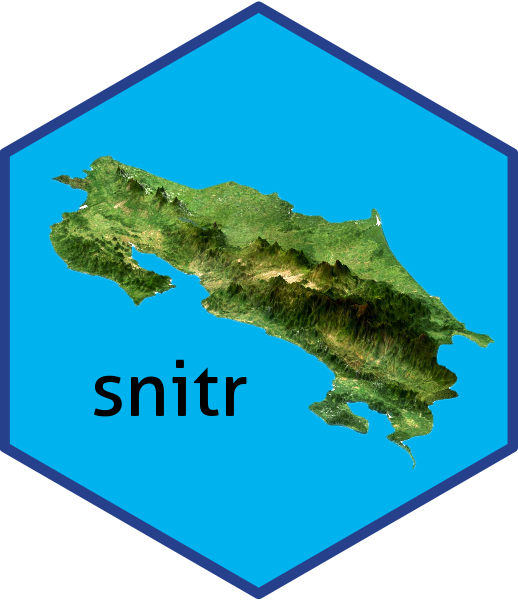

<!-- README.md is generated from README.Rmd. Please edit that file -->

# snitr 

<!-- badges: start -->
<!-- badges: end -->

The goal of snitr is to download data from SNIT

## Installation

You can install the development version of snitr from
[GitHub](https://github.com/) with:

``` r
# install.packages("pak")
pak::pak("ManuelSpinola/snitr")
```

## Example

This is a basic example which shows you how to use the package:

``` r
library(snitr)
## basic example code
```

``` r
capas <- list_IGN_5k()
#> Linking to GEOS 3.11.0, GDAL 3.5.3, PROJ 9.1.0; sf_use_s2() is TRUE
#> No encoding supplied: defaulting to UTF-8.
#>  [1] "IGN_5:forestal2017_5k"      "IGN_5:cultivos2017_5k"     
#>  [3] "IGN_5:curvas_5000"          "IGN_5:delimitacion2017_5k" 
#>  [5] "IGN_5:edificaciones2017_5k" "IGN_5:hidrografia_5000"    
#>  [7] "IGN_5:limitecantonal_5k"    "IGN_5:limitedistrital_5k"  
#>  [9] "IGN_5:limiteprovincial_5k"  "IGN_5:linea_costa_5000"    
#> [11] "IGN_5:pastos2017_5k"        "IGN_5:urbano_5000"         
#> [13] "IGN_5:vias_5000"
```

``` r
layer_name <- "IGN_5:delimitacion2017_5k"
```

``` r
output_file <- "IGN_5_delimitacion2017_5k.gpkg"
```

``` r
get_IGN_5k(layer_name, output_file = output_file)
#> Reading layer `file4aca56abea24' from data source 
#>   `/private/var/folders/96/m4trt68j16v3n97qk3zkxrk40000gn/T/RtmpEXZglg/file4aca56abea24.geojson' 
#>   using driver `GeoJSON'
#> Simple feature collection with 475 features and 3 fields
#> Geometry type: MULTIPOLYGON
#> Dimension:     XY
#> Bounding box:  xmin: 156147.2 ymin: 608238.1 xmax: 658879.4 ymax: 1241118
#> Projected CRS: CR05 / CRTM05
#> Deleting source `IGN_5_delimitacion2017_5k.gpkg' using driver `GPKG'
#> Writing layer `IGN_5_delimitacion2017_5k' to data source 
#>   `IGN_5_delimitacion2017_5k.gpkg' using driver `GPKG'
#> Writing 475 features with 3 fields and geometry type Multi Polygon.
#> [1] "IGN_5_delimitacion2017_5k.gpkg"
```
